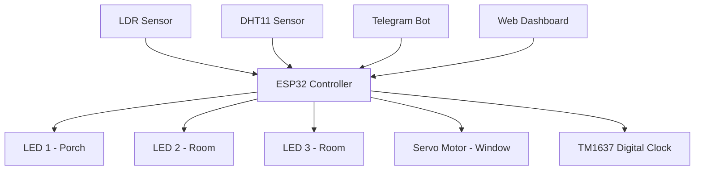
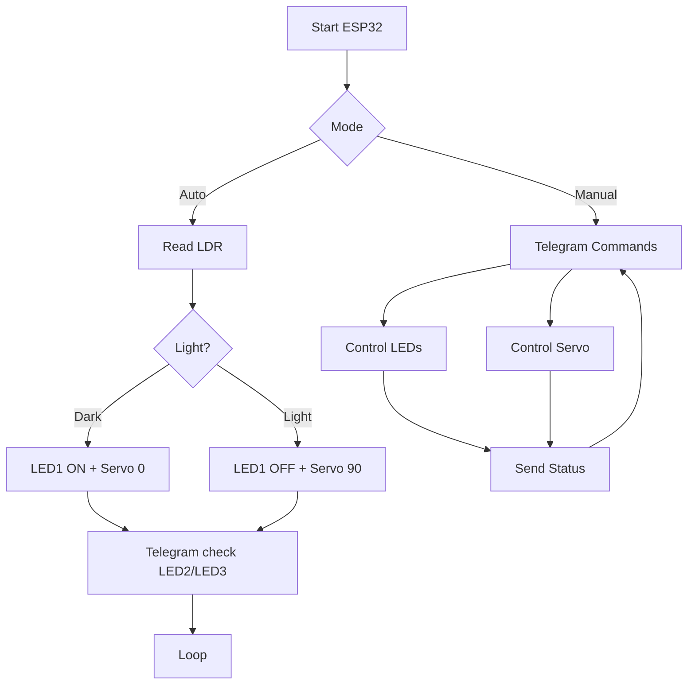

<!--- TITTLE --->
<p align="center">
  <picture>
    <source media="(prefers-color-scheme: light)" 
      srcset="https://readme-typing-svg.herokuapp.com?font=JetBrains+Mono&weight=700&size=40&center=true&vCenter=true&width=800&speed=60&pause=1200&color=000000&lines=Booting+ESP32+System...;Initializing+IoT+Modules...;Connecting+WiFi+Network...;Syncing+with+Telegram+Bot...;System+Ready+%E2%9C%94">

   <source media="(prefers-color-scheme: dark)" 
      srcset="https://readme-typing-svg.herokuapp.com?font=JetBrains+Mono&weight=700&size=40&center=true&vCenter=true&width=800&speed=60&pause=1200&color=4A90E2&lines=Booting+ESP32+System...;Initializing+IoT+Modules...;Connecting+WiFi+Network...;Syncing+with+Telegram+Bot...;System+Ready+%E2%9C%94">

  
  </picture>
</p>

<!--- SNS --->
<div align="center"><a href="https://instagram.com/ww.naoe"><picture><source media="(prefers-color-scheme: light)" srcset="https://img.shields.io/badge/ww.naoe-ffffff?style=for-the-badge&logo=instagram&logoColor=000000"><source media="(prefers-color-scheme: dark)" srcset="https://img.shields.io/badge/ww.naoe-111111?style=for-the-badge&logo=instagram&logoColor=ffffff"></picture></a><a href="#"><picture><source media="(prefers-color-scheme: light)" srcset="https://img.shields.io/badge/soon-ffffff?style=for-the-badge&logo=x&logoColor=000000"><source media="(prefers-color-scheme: dark)" srcset="https://img.shields.io/badge/soon-111111?style=for-the-badge&logo=x&logoColor=ffffff"></picture></a><a href="#"><picture><source media="(prefers-color-scheme: light)" srcset="https://img.shields.io/badge/soon-ffffff?style=for-the-badge&logo=youtube&logoColor=000000"><source media="(prefers-color-scheme: dark)" srcset="https://img.shields.io/badge/soon-111111?style=for-the-badge&logo=youtube&logoColor=ffffff"></picture></a><a href="mailto:harsadella@gmail.com"><picture><source media="(prefers-color-scheme: light)" srcset="https://img.shields.io/badge/email%20me-ffffff?style=for-the-badge&logo=gmail&logoColor=000000"><source media="(prefers-color-scheme: dark)" srcset="https://img.shields.io/badge/email%20me-111111?style=for-the-badge&logo=gmail&logoColor=ffffff"></picture></a></div>

<!--- BIG TITTLE--->
<h1 align="center">IOT SMART HOME PROJECT USING TELEGRAM BOT</h1>
<!--- OVERVIEW --->
</div>

This project is a smart home automation system powered by ESP32, designed as a lightweight IoT solution for remote and intelligent home control. Through Telegram integration, users can monitor and control their environment in real time from anywhere.

The system supports both manual and autonomous operation, combining environmental sensing, smart lighting control, servo-driven window automation, and real-time synchronization via NTP.

Built as an IoT prototype, this project demonstrates a scalable foundation for modern smart home systems that integrate embedded hardware, sensor networks, and cloud-based messaging interfaces.

<!--- FEATURES --->
## Features

- Dual operating modes: Manual and Automatic via Telegram  
- LDR-based ambient light control system  
- Automated window control using servo motor based on light intensity  
- Full manual override for lighting system via Telegram commands  
- Remote window actuation (open/close) via Telegram interface  
- Real-time temperature and humidity monitoring using DHT11 sensor  
- On-demand sensor data retrieval via Telegram (/check_temperature, /check_humidity)  
- Remote-configurable digital clock via Telegram / Web Dashboard

<!--- SYSTEM ARCHITECTURE --->
## Smart Home IoT System (ESP32 + Telegram + Web Dashboard)

### System Overview
The system is built around ESP32 as the main controller. It processes sensor data and user commands, then controls all outputs in real time through Telegram and Web Dashboard.

### Communication Flow
- ESP32 connects to WiFi for internet access  
- Telegram Bot is used for remote control and monitoring  
- Web Dashboard is used for time (clock) configuration  
- Commands are parsed and executed by ESP32  

### System Architecture



### System Behavior
<b>1. Automatic Mode (Telegram: "Automatic")</b>
- LED 1 ON when LDR = dark, OFF when bright  
- Servo closes (0°) when dark, opens (90°) when bright  
- LED 2 and LED 3 still controllable via Telegram

<b>2. Manual Mode (Telegram: "Manual")</b>           
Full control via Telegram:
- LED1, LED2, LED3 ON/OFF
- Servo open/close  

<b>3. Sensor Monitoring </b>
- /check_temperature 
- /check_humidity  
- Data only shown on request  

### System Flow



### Data Flow
1. LDR reads light condition  
2. ESP32 checks mode (Auto/Manual)  
3. Logic decides output actions  
4. DHT11 responds on request  
5. Status sent to Telegram when needed  

### Control Flow
- Auto Mode → LDR controls LED1 + Servo  
- Manual Mode → Telegram controls all devices  

### Communication Layer
- WiFi connection via ESP32  
- Telegram Bot for control + monitoring  
- Web Dashboard for clock settings  
- Two-way communication (command + feedback)

<!--- Hardware / Components --->
## Hardware / Components

| Component        | Description                          |
|------------------|--------------------------------------|
| ESP32            | Main controller                      |
| LDR Sensor       | Detects light (dark / bright)        |
| DHT11            | Temperature and humidity sensor      |
| LED 1            | Porch light (auto + manual)          |
| LED 2            | Room light (manual)                  |
| LED 3            | Room light (manual)                  |
| Servo Motor      | Window open/close (0° / 90°)         |
| TM1637 Display   | 4-digit digital clock display        |
| WiFi Connection  | Internet communication               |

<!--- PIN MAPPING --->
## Pin Mapping (ESP32 GPIO)

| Component       | ESP32 GPIO | Description                     |
|-----------------|------------|---------------------------------|
| LDR Sensor      | GPIO 34    | Analog input (light detection) |
| DHT11           | GPIO 14    | Temp & humidity sensor         |
| LED 1           | GPIO 25    | Porch light                    |
| LED 2           | GPIO 26    | Room light                     |
| LED 3           | GPIO 27    | Room light                     |
| Servo Motor     | GPIO 13    | PWM control (window)           |
| TM1637 CLK      | GPIO 18    | Clock signal                   |
| TM1637 DIO      | GPIO 19    | Data signal                    |

> Note: The GPIO pins used in this project are configurable. The values below are based on the current implementation and can be adjusted as needed.

<!--- WIRING DIAGRAM --->
## Wiring Diagram


| Component   | ESP32 Pin | Connection Details              |
|------------|----------|---------------------------------|
| LDR        | GPIO 34  | Analog pin + voltage divider    |
| DHT11      | GPIO 14  | Data pin (use pull-up resistor) |
| LED 1      | GPIO 25  | Through resistor to GND         |
| LED 2      | GPIO 26  | Through resistor to GND         |
| LED 3      | GPIO 27  | Through resistor to GND         |
| Servo      | GPIO 13  | Signal pin (VCC 5V, GND shared) |
| TM1637 CLK | GPIO 18  | Clock pin                       |
| TM1637 DIO | GPIO 19  | Data pin                        |
| VCC        | 3.3V / 5V| Power supply                    |
| GND        | GND      | Common ground                   |

> Note: All components must share a common ground. Ensure proper resistors are used for LEDs and LDR circuit.

<!--- CONTROL LOGIC (AUTO/MANUAL RULES) --->
## Control Logic (Auto / Manual Rules)

### Automatic Mode
- Activated via Telegram command: **"Automatic"**
- System behavior based on LDR sensor:
  - If light condition = **dark**:
    - LED 1 → ON  
    - Servo → 0° (window closed)  
  - If light condition = **bright**:
    - LED 1 → OFF  
    - Servo → 90° (window open)  
- LED 2 and LED 3:
  - Controlled manually via Telegram  

### Manual Mode
- Activated via Telegram command: **"Manual"**
- All components are fully controlled via Telegram:
  - LED 1 → ON / OFF  
  - LED 2 → ON / OFF  
  - LED 3 → ON / OFF  
  - Servo → Open (90°) / Close (0°)  

### Sensor Rules
- DHT11 is used only for monitoring:
  - `/check_temperature` → returns temperature  
  - `/check_humidity` → returns humidity  
- Sensor data does not affect automatic control  


### Mode Behavior Summary
- Automatic Mode → LDR controls LED 1 and Servo  
- Manual Mode → User controls all devices via Telegram

<!--- TELEGRAM BOT COMMANDS --->
## Telegram Bot Commands

### System Control
| Command      | Description                      |
|--------------|----------------------------------|
| /start       | Initialize system & choose mode  |
| Manual       | Activate manual mode             |
| Automatic    | Activate automatic mode          |

### LED Control
| Command      | Description            |
|--------------|------------------------|
| /LED1_ON     | Turn ON LED 1          |
| /LED1_OFF    | Turn OFF LED 1         |
| /LED2_ON     | Turn ON LED 2          |
| /LED2_OFF    | Turn OFF LED 2         |
| /LED3_ON     | Turn ON LED 3          |
| /LED3_OFF    | Turn OFF LED 3         |


### Window Control (Servo)
| Command        | Description               |
|----------------|---------------------------|
| /open_window   | Open window (90°)         |
| /close_window  | Close window (0°)         |


### Sensor Monitoring
| Command               | Description                  |
|------------------------|------------------------------|
| /check_temperature     | Get current temperature      |
| /check_humidity        | Get current humidity         |


> Notes
> In **Automatic Mode**:
> - LED 1 and window are controlled automatically by LDR  
> - LED 2 and LED 3 can still be controlled manually  

> In **Manual Mode**:
> - All components are fully controlled via Telegram

<!--- SETUP / INSTALLATION GUIDE --->
## Setup / Installation Guide

### 1. Hardware Setup
- Connect all components based on the wiring diagram  
- Ensure all GND are connected (common ground)  
- Power ESP32 via USB  
- Use external 5V supply for servo (recommended)  

### 2. Software Requirements
Install the following in Arduino IDE:
- ESP32 Board Package  
- Libraries:
  - WiFi.h  
  - WiFiClientSecure.h  
  - UniversalTelegramBot  
  - ArduinoJson  
  - ESP32Servo  
  - DHT sensor library  
  - TM1637Display  

### 3. Create Telegram Bot

#### Step 1: Open BotFather
- Open Telegram  
- Search: **@BotFather**  
- Click **Start**

#### Step 2: Create New Bot
- Send command:
```
/newbot
```
- Enter bot name (example: Smart Home Bot)  
- Enter username (must end with `bot`, example: smarthome_iot_bot)  

#### Step 3: Get Bot Token
- BotFather will give you a **BOT TOKEN**
- Example:
```
123456789:ABCdefGhIJKlmNoPQRstuVWxyz
```
- Copy this token

### 4. Get Your Chat ID

#### Method:
1. Open Telegram  
2. Search your bot username  
3. Click **Start**  
4. Send any message (e.g., "hello")  

Then open this URL in browser:
```
https://api.telegram.org/bot<YOUR_BOT_TOKEN>/getUpdates
```

Example:
```
https://api.telegram.org/bot123456789:ABC/getUpdates
```

5. Find `"chat":{"id":XXXXXXXX}`  
6. Copy the **chat ID**

### 5. Configure Code

Edit these lines in your code:

```cpp
#define WIFI_SSID     "YOUR_WIFI_NAME"
#define WIFI_PASSWORD "YOUR_WIFI_PASSWORD"
#define BOT_TOKEN     "YOUR_BOT_TOKEN"
```

(Optional: use Chat ID filtering for security)

### 6. Upload Code
- Select board: **ESP32 Dev Module**  
- Select correct COM port  
- Upload code to ESP32  

### 7. Run System
- Open Serial Monitor (115200 baud)  
- Wait until WiFi connected  
- Open Telegram bot  
- Send:
```
/start
```
- Choose mode: **Manual** or **Automatic**

### 8. Test Commands
- Try:
  - /LED1_ON  
  - /open_window  
  - /check_temperature  

System should respond and execute commands in real time

<!--- RESULT / OUTPUT --->
## Results / Output

### 1. Digital Clock Display (TM1637)
- Displays real-time clock (HH:MM format)  
- Time is synchronized using NTP via WiFi  
- Runs continuously during system operation  

### 2. Telegram Bot Output
- System responds to user commands in real time  
- Example outputs:
  - Mode activation messages (Manual / Automatic)  
  - Sensor data:
    - Temperature (°C)  
    - Humidity (%)  
- Acts as main interface for control and monitoring  

### 3. Serial Monitor Output
- Used for debugging and system monitoring  
- Displays:
  - WiFi connection status  
  - Incoming Telegram commands  
  - LDR sensor readings  
  - System mode changes (Manual / Automatic)  
- Helps verify system behavior during development

<!--- FUTURE IMPROVEMENTS --->
## Future Improvements

- Add mobile app or web dashboard for full control (not only clock setting)  
- Implement data logging (temperature, humidity, light) to database or cloud  
- Add notification system (e.g., alert when temperature too high or unusual activity)  
- Improve security using Telegram chat ID filtering or authentication system  
- Add more sensors (e.g., gas sensor, motion sensor, rain sensor)  
- Upgrade display to LCD/OLED for richer information  
- Implement manual override safety in Automatic Mode  
- Optimize power management for long-term usage  

<!--- CLOSING --->
---
<p align="center">
  <i>"Without curiosity and experimentation, even the most complex system becomes inert."</i><br><br>
  <i>This project is developed for educational purposes.</i><br>
  <b>© 2026 Della Mila Yuniar</b>
</p>
