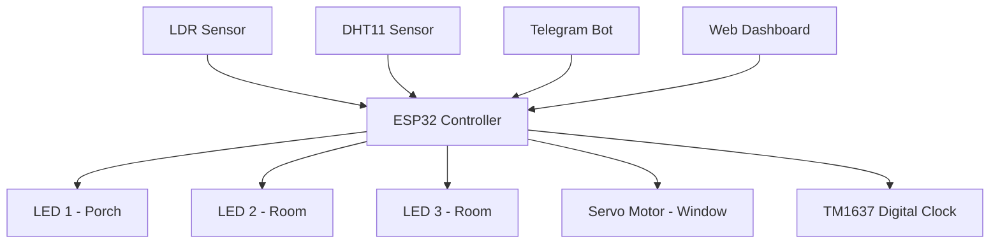
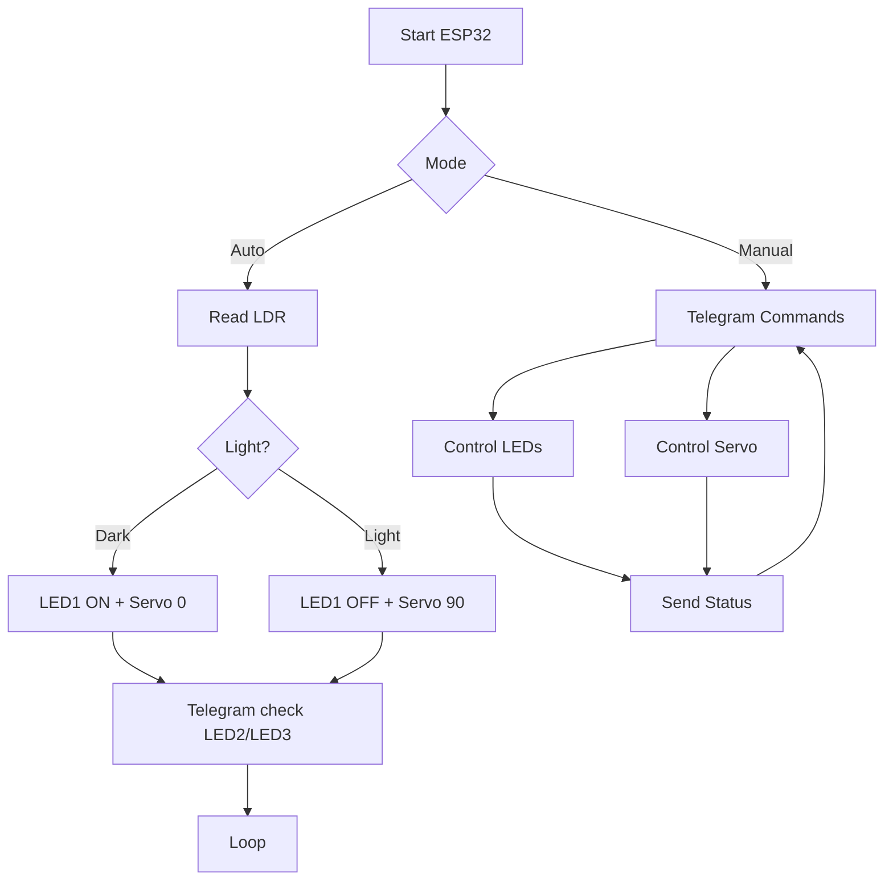

<!--- TITTLE --->

  <picture>
    <source media="(prefers-color-scheme: light)" 
      srcset="https://readme-typing-svg.herokuapp.com?font=JetBrains+Mono&weight=700&size=40&center=true&vCenter=true&width=800&speed=60&pause=1200&color=000000&lines=Booting+ESP32+System...;Initializing+IoT+Modules...;Connecting+WiFi+Network...;Syncing+with+Telegram+Bot...;System+Ready+%E2%9C%94">

   <source media="(prefers-color-scheme: dark)" 
      srcset="https://readme-typing-svg.herokuapp.com?font=JetBrains+Mono&weight=700&size=40&center=true&vCenter=true&width=800&speed=60&pause=1200&color=4A90E2&lines=Booting+ESP32+System...;Initializing+IoT+Modules...;Connecting+WiFi+Network...;Syncing+with+Telegram+Bot...;System+Ready+%E2%9C%94">

  
  </picture>

<!--- SNS --->

<a href="https://instagram.com/ww.naoe"><picture><source media="(prefers-color-scheme: light)" srcset="https://img.shields.io/badge/ww.naoe-ffffff?style=for-the-badge&logo=instagram&logoColor=000000"><source media="(prefers-color-scheme: dark)" srcset="https://img.shields.io/badge/ww.naoe-111111?style=for-the-badge&logo=instagram&logoColor=ffffff"></picture></a><a href="#"><picture><source media="(prefers-color-scheme: light)" srcset="https://img.shields.io/badge/soon-ffffff?style=for-the-badge&logo=x&logoColor=000000"><source media="(prefers-color-scheme: dark)" srcset="https://img.shields.io/badge/soon-111111?style=for-the-badge&logo=x&logoColor=ffffff"></picture></a><a href="#"><picture><source media="(prefers-color-scheme: light)" srcset="https://img.shields.io/badge/soon-ffffff?style=for-the-badge&logo=youtube&logoColor=000000"><source media="(prefers-color-scheme: dark)" srcset="https://img.shields.io/badge/soon-111111?style=for-the-badge&logo=youtube&logoColor=ffffff"></picture></a><a href="mailto:harsadella@gmail.com"><picture><source media="(prefers-color-scheme: light)" srcset="https://img.shields.io/badge/email%20me-ffffff?style=for-the-badge&logo=gmail&logoColor=000000"><source media="(prefers-color-scheme: dark)" srcset="https://img.shields.io/badge/email%20me-111111?style=for-the-badge&logo=gmail&logoColor=ffffff"></picture></a>

<!--- BIG TITTLE--->
<h1 align="center">IOT SMART HOME PROJECT USING TELEGRAM BOT</h1>
<!--- OVERVIEW --->

This project is a smart home automation system powered by ESP32, designed as a lightweight IoT solution for remote and intelligent home control. Through Telegram integration, users can monitor and control their environment in real time from anywhere.

The system supports both manual and autonomous operation, combining environmental sensing, smart lighting control, servo-driven window automation, and real-time synchronization via NTP.

Built as an IoT prototype, this project demonstrates a scalable foundation for modern smart home systems that integrate embedded hardware, sensor networks, and cloud-based messaging interfaces.

<!--- FEATURES --->
## Features

- Dual operating modes: Manual and Automatic via Telegram  
- LDR-based ambient light control system  
- Automated window control using servo motor based on light intensity  
- Full manual override for lighting system via Telegram commands  
- Remote window actuation (open/close) via Telegram interface  
- Real-time temperature and humidity monitoring using DHT11 sensor  
- On-demand sensor data retrieval via Telegram (/check_temperature, /check_humidity)  
- Remote-configurable digital clock via Telegram / Web Dashboard

<!--- SYSTEM ARCHITECTURE --->
## Smart Home IoT System (ESP32 + Telegram + Web Dashboard)

### System Overview
The system is built around ESP32 as the main controller. It processes sensor data and user commands, then controls all outputs in real time through Telegram and Web Dashboard.

### Communication Flow
- ESP32 connects to WiFi for internet access  
- Telegram Bot is used for remote control and monitoring  
- Web Dashboard is used for time (clock) configuration  
- Commands are parsed and executed by ESP32  

### System Architecture

### System Behavior
<b>1. Automatic Mode (Telegram: "Automatic")</b>
- LED 1 ON when LDR = dark, OFF when bright  
- Servo closes (0°) when dark, opens (90°) when bright  
- LED 2 and LED 3 still controllable via Telegram

<b>2. Manual Mode (Telegram: "Manual")</b>           
Full control via Telegram:
- LED1, LED2, LED3 ON/OFF
- Servo open/close  

<b>3. Sensor Monitoring </b>
- /check_temperature 
- /check_humidity  
- Data only shown on request  

### System Flow

### Data Flow
1. LDR reads light condition  
2. ESP32 checks mode (Auto/Manual)  
3. Logic decides output actions  
4. DHT11 responds on request  
5. Status sent to Telegram when needed  

### Control Flow
- Auto Mode → LDR controls LED1 + Servo  
- Manual Mode → Telegram controls all devices  

### Communication Layer
- WiFi connection via ESP32  
- Telegram Bot for control + monitoring  
- Web Dashboard for clock settings  
- Two-way communication (command + feedback)

<!--- Hardware / Components --->
## Hardware / Components

| Component        | Description                          |
|------------------|--------------------------------------|
| ESP32            | Main controller                      |
| LDR Sensor       | Detects light (dark / bright)        |
| DHT11            | Temperature and humidity sensor      |
| LED 1            | Porch light (auto + manual)          |
| LED 2            | Room light (manual)                  |
| LED 3            | Room light (manual)                  |
| Servo Motor      | Window open/close (0° / 90°)         |
| TM1637 Display   | 4-digit digital clock display        |
| WiFi Connection  | Internet communication               |

<!--- PIN MAPPING --->
## Pin Mapping (ESP32 GPIO)

| Component       | ESP32 GPIO | Description                     |
|-----------------|------------|---------------------------------|
| LDR Sensor      | GPIO 34    | Analog input (light detection) |
| DHT11           | GPIO 14    | Temp & humidity sensor         |
| LED 1           | GPIO 25    | Porch light                    |
| LED 2           | GPIO 26    | Room light                     |
| LED 3           | GPIO 27    | Room light                     |
| Servo Motor     | GPIO 13    | PWM control (window)           |
| TM1637 CLK      | GPIO 18    | Clock signal                   |
| TM1637 DIO      | GPIO 19    | Data signal                    |

> Note: The GPIO pins used in this project are configurable. The values below are based on the current implementation and can be adjusted as needed.

<!--- WIRING DIAGRAM --->
## Wiring Diagram

| Component   | ESP32 Pin | Connection Details              |
|------------|----------|---------------------------------|
| LDR        | GPIO 34  | Analog pin + voltage divider    |
| DHT11      | GPIO 14  | Data pin (use pull-up resistor) |
| LED 1      | GPIO 25  | Through resistor to GND         |
| LED 2      | GPIO 26  | Through resistor to GND         |
| LED 3      | GPIO 27  | Through resistor to GND         |
| Servo      | GPIO 13  | Signal pin (VCC 5V, GND shared) |
| TM1637 CLK | GPIO 18  | Clock pin                       |
| TM1637 DIO | GPIO 19  | Data pin                        |
| VCC        | 3.3V / 5V| Power supply                    |
| GND        | GND      | Common ground                   |

> Note: All components must share a common ground. Ensure proper resistors are used for LEDs and LDR circuit.

<!--- CONTROL LOGIC (AUTO/MANUAL RULES) --->
## Control Logic (Auto / Manual Rules)

### Automatic Mode
- Activated via Telegram command: **"Automatic"**
- System behavior based on LDR sensor:
  - If light condition = **dark**:
    - LED 1 → ON  
    - Servo → 0° (window closed)  
  - If light condition = **bright**:
    - LED 1 → OFF  
    - Servo → 90° (window open)  
- LED 2 and LED 3:
  - Controlled manually via Telegram  

### Manual Mode
- Activated via Telegram command: **"Manual"**
- All components are fully controlled via Telegram:
  - LED 1 → ON / OFF  
  - LED 2 → ON / OFF  
  - LED 3 → ON / OFF  
  - Servo → Open (90°) / Close (0°)  

### Sensor Rules
- DHT11 is used only for monitoring:
  - `/check_temperature` → returns temperature  
  - `/check_humidity` → returns humidity  
- Sensor data does not affect automatic control  

### Mode Behavior Summary
- Automatic Mode → LDR controls LED 1 and Servo  
- Manual Mode → User controls all devices via Telegram  
